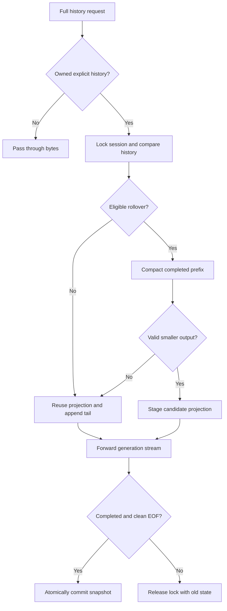

# Rolling projection contract

This describes the default standalone backend. The opt-in [inline backend](inline-backend.md) uses the same original-history mapping and commit discipline, with a cut extending through the latest provider checkpoint in the completed response output.

## Representation

Let `H_t` be the client's original full input array at time `t`. A committed lane holds an epoch `e`, a cut offset `b_e`, and a projection `P_e`. The outbound input is:

`W_t = P_e ++ H_t[b_e:]`

`++` is ordered array concatenation. Initially `P_0=[]` and `b_0=0`. Within an epoch, neither the projection nor the cut moves. Every original item retains all fields; serialization is deterministic through the default ordered `serde_json::Map`. This provides a stable serialized input prefix for append-only requests. It is not a claim that JSON byte equality alone establishes equality of the provider's hidden rendered prompt.

At an eligible new-user boundary `b_next > b_e`, the compactor receives:

`K = P_e ++ H_t[b_e:b_next]`

If its full output passes the acceptance gate, the candidate becomes:

`P_next = compact(K).output`

`W_t = P_next ++ H_t[b_next:]`

All compact output items, including retained messages, are kept in their original order. The implementation does not isolate or splice only the encrypted item. The next rollover therefore incorporates the previous compacted state and the newly completed turns, with neither omission nor double inclusion of original history before the cut.

The provider's [standalone compaction contract](https://developers.openai.com/api/docs/guides/compaction) supplies the canonical replacement window. Its semantic quality is a provider behavior requiring evaluation; the proxy's exact guarantees concern item selection and protocol handling.

## Transaction lifecycle

Compaction is preparation, not a commit. Provider 2xx alone is insufficient: the generation must report `status=completed` in its JSON response or complete SSE terminal event. The stream must end without transport failure. Bounded observation overflow also prevents commit while allowing the response bytes to continue downstream.

A discarded candidate may have incurred a compaction charge. Retrying later may incur another charge. Both completed compactor calls appear in the ledger. There is no speculative main-request retry or silent reduction after an upstream context-limit error.

## History reconciliation

The lane stores SHA-256 hashes of all original request input items. Every later history must begin with those exact item fingerprints. Same-length edits are detected; timestamps are irrelevant. The proxy does not attempt fuzzy alignment after a client edit, branch, compaction, or truncation. Such a change clears the local projection and forwards the new history as authoritative.

The separate request-contract fingerprint contains every top-level field except `input`, `stream`, `stream_options`, and `metadata`. Thus tool definitions and ordering, response format, verbosity, reasoning parameters, instructions, cache settings, and model changes cannot silently reuse an old projection. Generated cache keys remain independent of epoch so a rollover does not gratuitously change the routing key as well as the context.

The identity hash includes upstream, compact path, authorization, compatible `api-key`/`x-api-key` credentials, `chatgpt-account-id`, organization, project, session, and model. It is not derived from `prompt_cache_key` because callers may share that key across conversations. Authentication rotation or a compact-path change opens another lane and can reduce reuse; neither can silently mix two scopes. Duplicate credential and account headers are rejected before forwarding. A supplied API-key header also suppresses the `OPENAI_API_KEY` environment fallback.

## Tool and reasoning boundary

Only a final user message opens a rollover opportunity. The planner retains at least the configured number of most recent user turns. It scans known externally executed calls and outputs using their call IDs; duplicate calls, orphan outputs, missing IDs, and pending calls prevent compaction. Unknown input items remain unchanged. The retained tail contains complete original items, including encrypted reasoning, assistant phase, refusals, images, and tool arguments/results.

The [reasoning guide](https://developers.openai.com/api/docs/guides/reasoning) recommends preserving the full active tool cycle. The proxy does not decrypt or rewrite reasoning and does not force a reasoning-context policy on the caller.

## Cache and rollover are distinct

The local lane records which projection was successfully used; it does not own an upstream cache lease. Size pressure is the default rollover trigger. An inactivity trigger is opt-in and labeled as a heuristic in telemetry. A miss on an otherwise identical request does not immediately cause compaction or reset the key. Rollover deliberately changes the context prefix; its benefit must repay the new prefill, compaction work, and potential quality cost.

Modern API cache controls are added only for known model families on the official HTTPS Platform origin. Earlier families use their supported legacy settings. Unknown backends receive no inferred Platform-only parameters. Explicit caller fields are preserved even when their validity cannot be established locally, leaving provider validation authoritative.

## Operating boundaries

One process owns each state directory. The process lock, lane mutex, staged copy, and atomic snapshot together provide single-writer local ordering. This is not a distributed session store. Horizontal deployments need sticky session routing plus an external store with versioned compare-and-swap before sharing state.

State is bounded by maximum file/request sizes and session admission count. Histories remain on the client, while this proxy stores item hashes and the canonical projection. Accounting is append-only and has no built-in retention. A remote observability collector should aggregate metadata rather than copy projections.

The byte budget manages transport size. It does not measure encrypted token counts, enforce a model context window, or calculate an optimal economic rollover point. Native compaction can reduce token use while increasing serialized encrypted bytes; this version may reject that result under its explicitly byte-based acceptance gate.
